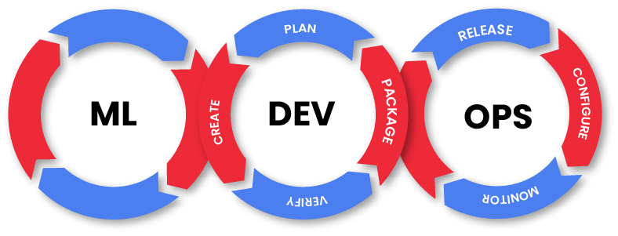

# Project 1: Machine Learning Operations (MLOps)

## Introduction:

This project involves creating an API that utilizes a recommendation model for Steam, a multinational video game platform, based on Machine Learning. The goal is to develop a video game recommendation system for users. The API provides an intuitive interface for users to obtain information for the recommendation system and data on genres or specific dates.

## Tools Used:

- Pandas
- Matplotlib
- Numpy
- Seaborn
- Wordcloud
- NLTK
- Uvicorn
- Render
- FastAPI
- Python
- Scikit-Learn

## Step by Step:

### 1. ETL (Extraction, Transformation, Load):

We perform an ETL process where we extract data from different sources, transform it according to the project's needs, and load it into a final destination for analysis and later use. The primary tools used were Python, Pandas, Scikit-Learn, and FastAPI.

### 2. Feature Engineering:

As requested for this project, sentiment analysis was applied to user reviews. A new column named 'sentiment_analysis' was created to replace the column containing reviews, classifying the sentiments of the comments on a scale of 0 (bad), 1 (neutral or no review), to 2 (positive). We used NLTK for basic sentiment analysis, assigning a numeric value to the text to represent whether the sentiment expressed is negative, neutral, or positive.

### 3. EDA (Exploratory Data Analysis):

We conduct an EDA process where we explore and analyze the data thoroughly to obtain insights, identify patterns, trends, and relationships, aiming to provide a foundation for creating our ML model. The tools used were Numpy, Pandas, Matplotlib, Seaborn, Wordcloud, and NLTK.

## 4. Machine Learning Model:

We implemented a Machine Learning model to generate game recommendations, utilizing algorithms and techniques such as cosine similarity and Scikit-Learn. The aim is to provide personalized and accurate recommendations based on the tastes and preferences of each user. If it's an item-item recommendation system:

- **recomendacion_juego (Product ID):** By entering the product ID ('id), we should receive a list of 5 recommended games similar to the input.

  Example of usage: `70`

If it's a user-item recommendation system:

- **recomendacion_usuario (User ID):** By entering the user ID ('user_id'), we should receive a list of 5 recommended games for that user.

  Example of usage: `76561198030567998`

The tool used was Scikit-Learn with libraries such as TfidfVectorizer, linear_kernel, cosine_similarity. These functionalities are also accessible in the API.

### 5. API Deployment:

We create an API using the FastAPI module in Python, implementing 5 functions that can be queried:

- **PlayTimeGenre:** Receives a video game genre as a parameter and returns the year with the most played hours for that genre.

- **UserForGenre:** Receives a video game genre as a parameter and returns the user who accumulates the most played hours for the given genre and a list of accumulated hours played per year.

- **UsersRecommend:** Receives a year available in the dataframe and returns the top 3 games MOST recommended by users for the given year.

- **UsersWorstDeveloper:** Receives a year available in the dataframe and returns the top 3 developers LEAST recommended by users for the given year.

- **sentiment_analysis:** Receives a developer as a parameter and returns a dictionary with the developer's name as the key and a list with the total number of user review records categorized with sentiment analysis as the value.

- **recomendacion_juego:** Receives the name of a game as a parameter and returns a list with 5 games recommended similar to the input.

- **recomendacion_usuario:** Receives the user id as a parameter and returns a list with 5 games recommended for that user, considering similarities between users.

## Why Cosine Similarity?

We chose to use cosine similarity because it is a commonly used measure to assess the similarity between two vectors in a multidimensional space. In the context of recommendation systems and data analysis, cosine similarity is employed to determine how similar two datasets or elements are. It is calculated using the cosine of the angle between the vectors representing these data or elements.

Cosine similarity is particularly suitable for recommendation systems as it provides a measure of similarity that is unaffected by the magnitude of the vectors, focusing solely on the direction. This makes it effective for evaluating the similarity between items or users based on their preferences or behaviors.

The choice of cosine similarity in our Machine Learning model enables us to capture and utilize the underlying patterns and relationships between different games or users, contributing to the generation of personalized and accurate recommendations.

# Deployment

For the deployment of the API, we were assigned the Render platform, a unified cloud for creating and running applications and websites, allowing for automatic deployment from GitHub.

We created a new service on render.com, connected to this repository. However, a challenge encountered during deployment was that the free version of this platform only provides 512 MB of memory. Given that our API in local development with its complete datasets exceeded this limit, it was not feasible to deploy it in its original form. As a solution, we had to remove the second user-item recommendation system, reduce the size of the data, and compress it into gz files.

Finally, the lightweight version of the API is running at https://project-10-mlops.onrender.com.

# Local Setup Guide for Full API Access

To utilize the API locally and enjoy 100% of the data, including the user-item recommendation system, follow this step-by-step guide:

1. Clone the project using: `https://github.com/luifa04/Project_1_MLOps.git`.

2. Set up the working environment in Visual Studio Code:

    - Create a Python environment: `python -m venv env`
  
    - Activate the environment: `venv\Scripts\activate`
  
    - Install dependencies: `pip install -r requirements.txt`

3. Run the `main.py` file from the console by activating uvicorn. Use the following command: `uvicorn main:app --reload`

4. Click Ctrl + left-click on the address `http://127.0.0.1:8000/` (displayed in the console).

5. If everything is correct, you will be on the INDEX of the API.

# Video

[In this video](https://www.loom.com/share/bfe41b0ca0f84d739190d47b8406907d?sid=54b51f7d-59ae-40b2-8df9-5d66587f9ce7), we will provide a brief explanation of the project, showcasing the functionality of the API.

# Conclusion:

Thank you for watching this brief overview of my project and the functionality of the API. If you're interested in exploring more or have any questions, feel free to connect with me on LinkedIn.

[Connect with me on LinkedIn](https://www.linkedin.com/in/mateo-lopez-ba06861b3/)

